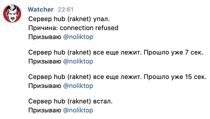

## watcher

Watcher следит за указанными ему серверами. Если какой-то из серверов прекратил работу, watcher предупредит Вас об этом

Watcher умеет следить за **tcp**, **udp**, **rcon**, **raknet**, **http** серверами.

Если вы хотите следить за состоянием сервера Minecraft (Pocket/Bedrock edition), используйте **raknet** и/или **rcon**.

Проверяя подключение к raknet можно понять, жив ли поток raknet, осуществляющий коммуникацию клиента майнкрафта и сервера.

Проверяя подключение к rcon можно понять, жив ли главный поток сервера. 


--

## Установка

Для нормальной работы Watcher рекомендуется иметь версию Go 1.17 или выше

```shell script
go install github.com/NolikTop/watcher@latest
```

## Запуск

```shell script
watcher -config=путь/до/конфига.json
```

---

## Конфиг

Пример конфига:

```json
{
  "chats": [
    {
      "name": "web",
      "method": "vk",
      "data": {
        "chat_id": 1,
        "access_token": "abcdef"
      }
    },
    {
      "name": "minecraft",
      "method": "vk",
      "data": {
        "chat_id": 2,
        "access_token": "abcdef"
      }
    }
  ],
  "servers": [
    {
      "name": "my raknet server",
      "addr": "127.0.0.1:19132",
      "protocol": "raknet",
      "chats": [
        "minecraft"
      ],
      "mentions_text": "@online"
    },
    {
      "name": "my rcon server",
      "addr": "127.0.0.1:19132",
      "protocol": "rcon",
      "chats": [
        "minecraft",
        "web"
      ],
      "mentions_text": "@online",
      "data": {
        "command": "some_command",
        "password": "abcdef"
      }
    },
    {
      "name": "my http server",
      "addr": "127.0.0.1:8008",
      "protocol": "http",
      "chats": [
        "web"
      ],
      "mentions_text": "@all"
    },
    {
      "name": "my tcp server",
      "addr": "127.0.0.1:3456",
      "protocol": "tcp",
      "chats": [
        "web"
      ],
      "mentions_text": "@all"
    },
    {
      "name": "my udp server",
      "addr": "127.0.0.1:1234",
      "protocol": "udp",
      "chats": [
        "web"
      ],
      "mentions_text": "@online",
      "data": {
        "send_bytes_base64": "c29tZSBieXRlcw=="
      }
    }
  ]
}
```

Поле | Описание
------------ | -------------
chats | список [чатов](#чат)
servers | список [серверов](#сервер)

### Сервер

Описание **обязательных** полей

Поле | Описание
------------ | -------------
name | имя сервера (нужно для уведомлений, чтобы Вы поняли какой именно сервер упал)
addr | адрес сервера
protocol | tcp/udp/raknet/rcon/http. Протокол, используемый сервером
chats | список названий способов связи, в которые будет писаться информация о падении сервера
mentions_text | строка, содержащая список упоминаний пользователей, которые ответственны за данный сервер
data | дополнительные данные

Также могут быть **дополнительные** данные (пишутся в поле "data") в зависимости от используемого протокола.

Для **UDP** сервера:

Поле | Описание
------------ | -------------
send_bytes_base64 | base64 байтов, после отправки которых watcher должен получить ответ от UDP сервера

Для **RCON** сервера:

Поле | Описание
------------ | -------------
command | команда, которая будет отправлена серверу
password | пароль RCON

### Чат

Чат — способ связи с разработчиком. 
Это не обязательно может быть в привычном нам понимании чат, 
здесь это просто некоторый способ доставки сообщений разработчику. 

Описание **обязательных** полей

Поле | Описание
------------ | -------------
name | имя чата (далее используется в поле сервера "chats")
method | метод (название соц-сети/мессенджера) через который watcher сможет достучаться до разработчика. Пока доступное значение только "vk" (ВКонтакте)
data | дополнительные данные

Также могут быть **дополнительные** данные (пишутся в поле "data") в зависимости от используемого метода.

Для метода **vk** и **tg**:

Поле | Описание
------------ | -------------
chat_id | id чата
access_token | токен с доступом к сообщениям

---

## Как watcher проверяет?

Watcher раз в определенное время проверяет возможность подключения к серверу. 
Если к серверу не удалось подключиться (или он ничего не вернул в случае UDP), то проверка считается проваленной.

Если последняя проверка watcher'а была проваленной, то watcher будет проверять каждую секунду, 
пока результат проверки не станет успешным
